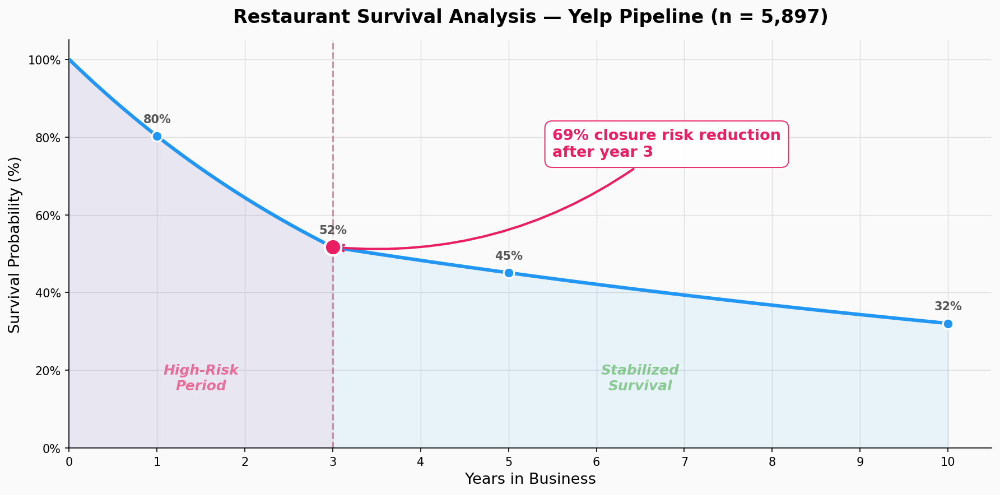
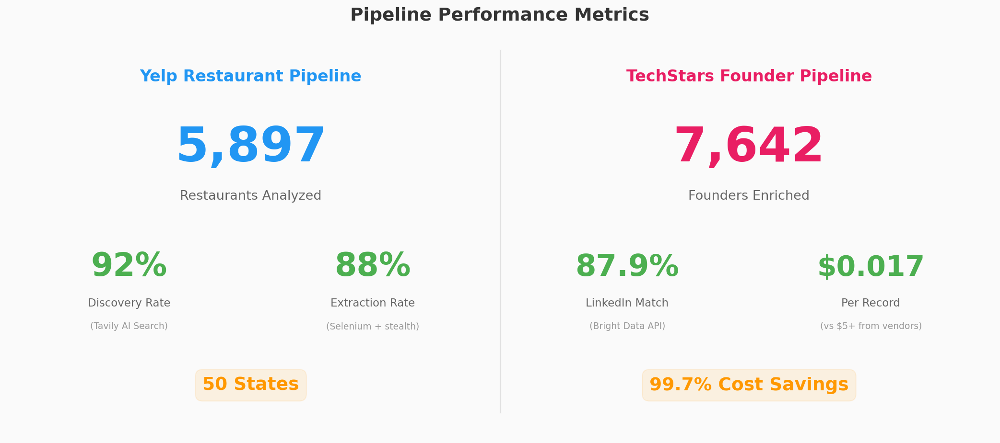

# alt-data-pipelines

Production-grade alternative data collection pipelines for quantitative research. Two independent systems: **restaurant longevity analysis** (5,897 restaurants, 50 states) and **founder intelligence** (7,642 founders, 87.9% LinkedIn match rate) — both designed to extract structured signals from unstructured public data at scale.

## Why Alternative Data

The best prediction market edges come from information asymmetry — knowing something the market hasn't priced in yet. These pipelines demonstrate the approach: systematically collect, clean, and structure public data into quantifiable signals that can inform event outcome pricing. The methodology generalizes to any domain where public data exists but isn't easily queryable.

## Pipelines

### Yelp Restaurant Longevity (`yelp-restaurant-longevity/`)

Systematic extraction of restaurant time-in-business data from Yelp reviews, producing survival analysis metrics for credit risk modeling.

```
    ┌──────────────────────────────────────────────┐
    │           Target Restaurant List              │
    │           (name, city, state)                 │
    └───────────────────┬──────────────────────────┘
                        │
            ┌───────────▼───────────┐
            │   Phase 1: Discovery   │
            │   Tavily AI Search     │
            │   → Yelp URL matching  │
            │   92% discovery rate   │
            └───────────┬───────────┘
                        │
            ┌───────────▼───────────┐
            │   Phase 2: Extraction  │
            │   Selenium + stealth   │
            │   → Review parsing     │
            │   → Date extraction    │
            │   88% extraction rate  │
            └───────────┬───────────┘
                        │
            ┌───────────▼───────────┐
            │   Phase 3: Analysis    │
            │   → First review date  │
            │   → Operating duration │
            │   → Survival metrics   │
            └───────────┬───────────┘
                        │
                        ▼
    ┌──────────────────────────────────────────────┐
    │   Output: Restaurant Longevity Dataset        │
    │   5,897 restaurants × 50 states               │
    │                                               │
    │   Key Finding: 3-year survival mark shows     │
    │   69% reduction in closure risk — a sharp     │
    │   threshold effect, not a gradual decline     │
    └──────────────────────────────────────────────┘
```

**Anti-Detection:** Custom user-agents, natural scroll behavior, randomized delays, session rotation — necessary for reliable extraction at scale without triggering rate limits.

**Scale:** 5,897 restaurants, 50 states, 92% URL discovery rate, 88% extraction success rate.

### TechStars Founder Intelligence (`techstars-founder-intelligence/`)

AI-powered pipeline for discovering, identifying, and enriching startup founder data from TechStars accelerator programs.

```
    ┌─────────────────────────────────┐
    │  TechStars Company Directory     │
    │  4,042 companies                 │
    └──────────────┬──────────────────┘
                   │
         ┌─────────▼─────────┐
         │  Company Scraping  │
         │  (program, year,   │
         │   location, URL)   │
         └─────────┬─────────┘
                   │
         ┌─────────▼─────────┐
         │  Founder Discovery │
         │  Tavily AI Search  │
         │  500-850 rec/min   │
         └─────────┬─────────┘
                   │
         ┌─────────▼─────────┐
         │  LinkedIn Enrich   │
         │  Bright Data API   │
         │  87.9% match rate  │
         └─────────┬─────────┘
                   │
                   ▼
    ┌─────────────────────────────────┐
    │  Output: Founder Intelligence    │
    │  7,642 founders enriched         │
    │  $0.017/record                   │
    │  (99.7% savings vs vendors)      │
    └─────────────────────────────────┘
```

## Key Findings

### Restaurant Survival Analysis

The Yelp pipeline revealed a sharp threshold effect at the 3-year mark: restaurants that survive past year 3 see a 69% reduction in annual closure risk. This non-linear survival curve is a stronger credit signal than linear age-based models.



### Pipeline Performance

Both pipelines achieve high-volume data extraction at minimal cost, demonstrating that alternative data collection can be systematic and scalable without enterprise vendor contracts.



## Signal Applications

These datasets aren't just static tables — they're inputs to predictive models:

- **Restaurant longevity** → Alternative credit risk scoring, survival probability estimation, Kalshi restaurant/economic outcome contracts
- **Founder intelligence** → Startup success probability, accelerator program outcome prediction, VC-adjacent event modeling
- **Methodology** → Generalizable to any domain where prediction market contracts reference entities with extractable public data

See [docs/SIGNAL_APPLICATIONS.md](docs/SIGNAL_APPLICATIONS.md) for detailed signal mapping to prediction market use cases.

## Tech Stack

- Python, Selenium, BeautifulSoup
- Tavily AI Search API (discovery + enrichment)
- Bright Data (LinkedIn data access)
- Pandas for data processing and analysis

## Setup

See individual pipeline directories for setup instructions.

## Related Projects

- [btc-short-term-alpha](https://github.com/pascal-labs/btc-short-term-alpha) — BTC binary strategy using price microstructure signals
- [tweet-volume-ensemble](https://github.com/pascal-labs/tweet-volume-ensemble) — 6-model ensemble consuming social media alternative data
- [market-maker-forensics](https://github.com/pascal-labs/market-maker-forensics) — Market microstructure context for signal application

## License

MIT
