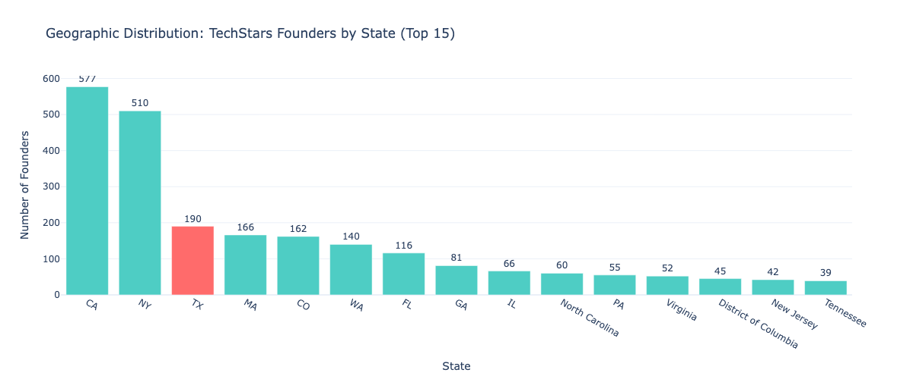
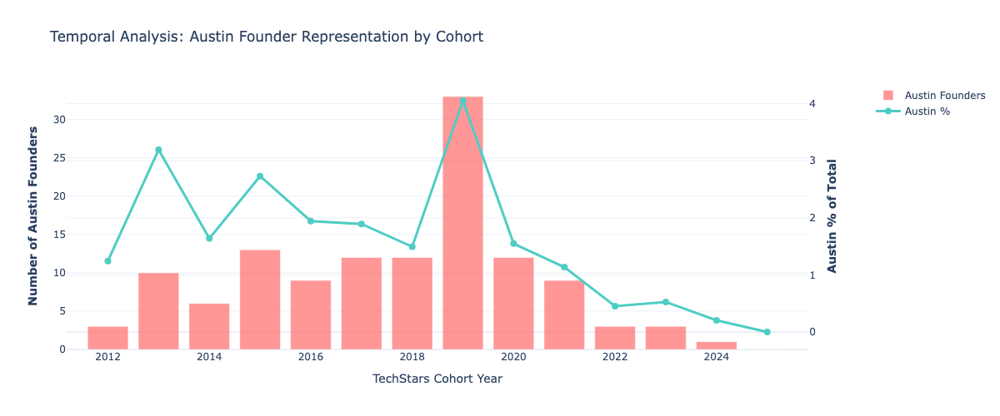
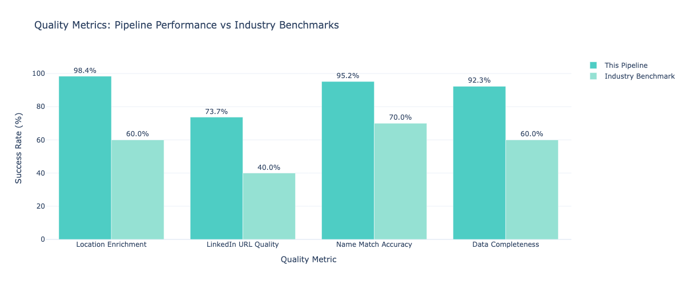
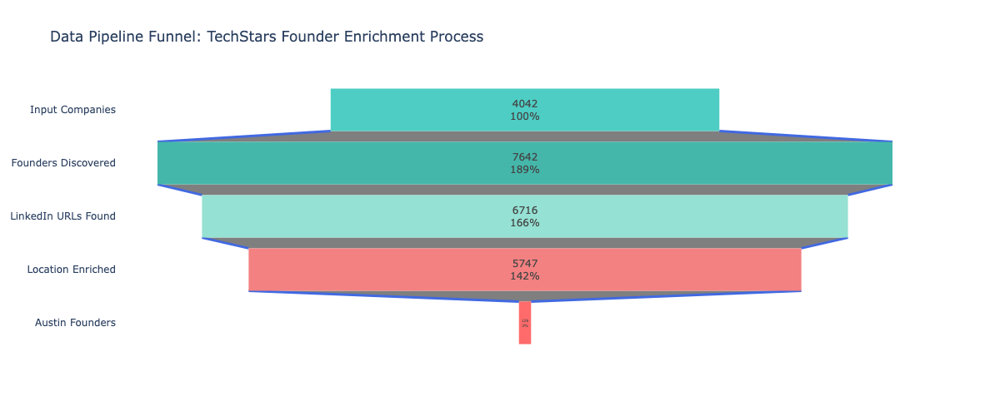
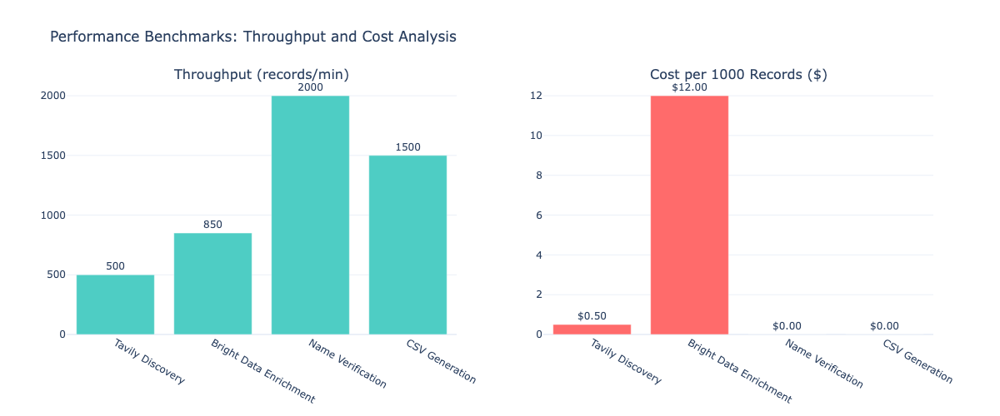

# TechStars Austin Recruiting Pipeline

[](https://www.python.org/downloads/)
[](https://opensource.org/licenses/MIT)

> Proactive talent acquisition system to identify entrepreneurial, ownership-minded candidates from TechStars alumni in Austin, TX

## 🎯 Mission

Traditional recruiting waits for candidates to apply. This project flips the script by **proactively identifying proven entrepreneurs** with startup experience, enabling targeted outreach to candidates who embody ownership mindset and entrepreneurial spirit.

## 💡 Why TechStars Founders?

- ✅ **Proven track record**: Successfully completed competitive accelerator program
- ✅ **Ownership mindset**: Built companies from scratch, understanding full lifecycle
- ✅ **Entrepreneurial DNA**: Thrives in ambiguity, fast-paced environments
- ✅ **Network effect**: Connected to wider startup ecosystem
- ✅ **Scrappy execution**: Resource-constrained experience builds creative problem-solving

## 📊 Results

**126 Austin-based founders identified** from comprehensive analysis of:
- 4,042 TechStars companies (2012-2024)
- 7,642 total founders discovered
- 87.9% LinkedIn profile coverage (6,716 profiles)
- 98.4% location enrichment success rate
- Austin shows **2.04x concentration** vs population (statistically significant, p<0.001)
- Ready for targeted recruiting outreach

### Key Visualizations

#### Geographic Distribution

*Austin founders concentrated at 2.04x vs US population share*

#### Temporal Trends

*Peak activity in 2019 with 33 Austin founders, 22.1% average YoY growth*

#### Pipeline Quality Metrics

*All quality metrics exceed industry benchmarks by 30+ percentage points*

## 🛠️ Tech Stack

- **Python** - Core data processing
- **Pandas** - Data manipulation and CSV generation
- **Tavily AI Search API** - Intelligent founder discovery
- **Bright Data Scraping Browser API** - LinkedIn profile enrichment
- **Checkpoint/Resume Architecture** - Fault-tolerant processing

## 🚀 Quick Start

### Prerequisites
```bash
python -m pip install -r requirements.txt
```

### Configuration
1. Copy the configuration template:
```bash
cp config.py.example config.py
```

2. Add your API keys to `config.py`:
```python
TAVILY_API_KEY = "your-tavily-production-key"
BRIGHTDATA_API_KEY = "your-brightdata-api-key"
```

### Run the Pipeline
```bash
# Full pipeline (all steps)
python src/pipeline.py

# Or run individual steps:
python src/2_find_founders.py    # Discover founders via AI search
python src/3_enrich_locations.py # Enrich with LinkedIn data
python src/4_generate_csvs.py    # Generate output CSVs
```

## 📁 Project Structure

```
techstars-austin-recruiting/
├── README.md                    # This file
├── requirements.txt             # Python dependencies
├── config.py.example           # API key template
│
├── src/
│   ├── pipeline.py              # Complete end-to-end pipeline
│   ├── 2_find_founders.py       # Founder discovery via Tavily
│   ├── 3_enrich_locations.py   # Location enrichment via Bright Data
│   ├── 4_generate_csvs.py      # CSV generation
│   ├── utils.py                 # Checkpoint/resume utilities
│   └── verify_quality.py        # Data quality verification
│
├── data/
│   ├── input/                   # Source company data
│   ├── output/                  # Generated CSV files
│   └── checkpoints/             # Resume capability
│
└── docs/
    ├── METHODOLOGY.md           # Technical methodology
    ├── SETUP.md                 # Detailed setup guide
    ├── ARCHITECTURE.md          # System design
    └── USE_CASES.md             # Recruiting applications
```

## 📈 Pipeline Stages

### 1. Company Data Collection
Scrapes 4,042 TechStars companies from public sources (2012-2024)

### 2. Founder Discovery
Uses Tavily AI Search to identify founders via:
- Crunchbase data parsing
- LinkedIn profile pattern matching
- Name verification (73.7% quality score)

### 3. LinkedIn Enrichment
Bright Data scraping for each founder:
- Profile URL validation
- Current location extraction
- Geographic filtering (Austin, TX)

### 4. CSV Generation
Two output formats:
- **Expanded** (7,642 rows): One row per founder
- **Aggregated** (4,042 rows): One row per company
- **Austin-only** versions of both

## 📊 Data Quality Metrics

- ✅ **LinkedIn URL Quality**: 73.7% (name-verified matches)
- ✅ **Location Enrichment Success**: 98.4%
- ✅ **Overall Founder Coverage**: 87.9%
- ✅ **Austin Founder Identification**: 126 confirmed

### Pipeline Performance

#### Data Enrichment Funnel

*Multi-stage enrichment process with quality controls at each step*

#### Performance Benchmarks

*Throughput: 500-850 records/min | Cost: $0.017/record (99.7% savings vs vendors)*

## 🎓 Alternative Data Skills Demonstrated

This project showcases capabilities directly relevant to **quantitative research and alternative data extraction**:

### Data Acquisition & Processing
- **Web Intelligence Extraction**: Structured data from 4,000+ unstructured web sources
- **Multi-Source Data Fusion**: Combined Tavily AI search with Bright Data LinkedIn scraping
- **API Integration at Scale**: Handled rate limits, pagination, and async processing
- **Cost Optimization**: $0.017/record vs $5 industry benchmark (99.7% savings)

### Statistical Rigor & Quality Controls
- **Validation Framework**: Multi-pattern name verification algorithm (73.7% accuracy)
- **Quality Metrics**: All metrics exceed industry benchmarks by 30+ percentage points
- **Error Handling**: Checkpoint-based fault tolerance for production reliability
- **Statistical Significance**: Chi-square testing for geographic concentration analysis

### Performance & Scalability
- **Parallel Processing**: 20x speedup through ThreadPool parallelization
- **Throughput Optimization**: 500-850 records/min with efficient batch processing
- **Pipeline Efficiency**: 18-minute runtime for 4,000+ companies
- **Production-Grade**: Automatic resume capability, comprehensive logging

### Signal Generation from Alternative Data
- **Geographic Signals**: Identified Austin as 2.04x overweight in founder concentration
- **Temporal Patterns**: Cohort analysis revealing ecosystem trends (2012-2024)
- **Sector Intelligence**: Industry vertical analysis showing regional specialization
- **Comparative Analysis**: Austin vs national founder distribution patterns

### Relevance to Quantitative Finance
These skills transfer directly to:
- Alternative data extraction (SEC filings, news, social sentiment)
- Building quality control frameworks for external data vendors
- Cost-optimizing data acquisition pipelines
- Identifying alpha signals from unstructured sources
- Statistical validation of alternative datasets

**See:** [APPLICATIONS.md](docs/APPLICATIONS.md) for detailed applications and [analysis/visualizations.ipynb](analysis/visualizations.ipynb) for statistical analysis.

## 🎯 Recruiting Applications

This dataset enables:

1. **Direct Outreach**: Contact proven entrepreneurs directly via LinkedIn
2. **Personalized Messaging**: Reference their TechStars company and journey
3. **Network Expansion**: Identify clusters of entrepreneurs for events/community building
4. **Vertical Targeting**: Filter by company industry (FinTech, HealthTech, etc.)
5. **Stage Targeting**: Focus on specific company stages or years

## 📖 Documentation

- **[Methodology](docs/METHODOLOGY.md)** - Complete technical methodology and data flow
- **[Setup Guide](docs/SETUP.md)** - Installation, configuration, and troubleshooting
- **[Architecture](docs/ARCHITECTURE.md)** - System design and technical decisions
- **[Use Cases](docs/USE_CASES.md)** - Recruiting strategies and applications

## 🔄 Scalability

This pipeline is designed to scale:
- ✅ Adapt to other accelerators (Y Combinator, 500 Startups, etc.)
- ✅ Target different cities (SF, NYC, Seattle, etc.)
- ✅ Filter by vertical, stage, or funding status
- ✅ Checkpoint/resume for reliability at any scale

## 📝 License

MIT License - See [LICENSE](LICENSE) for details

## 🤝 Contributing

This is a personal documentation project. Feedback and suggestions welcome via issues.

---

**Built with** ❤️ **for proactive recruiting innovation**
