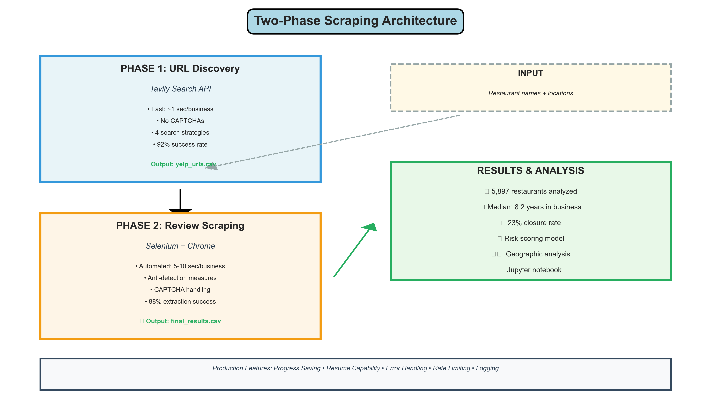
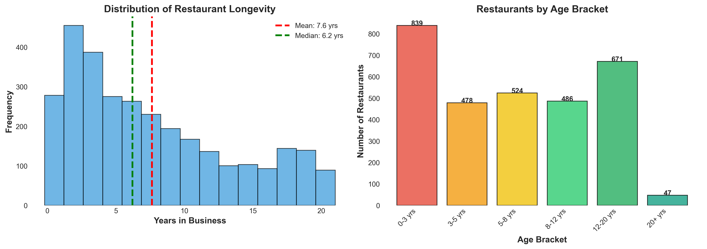
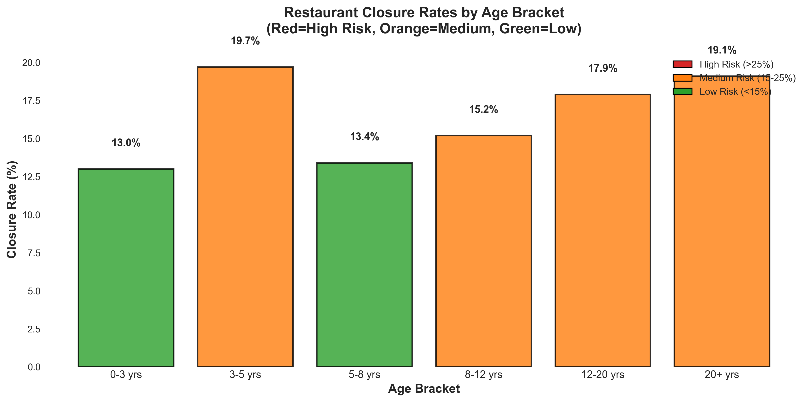
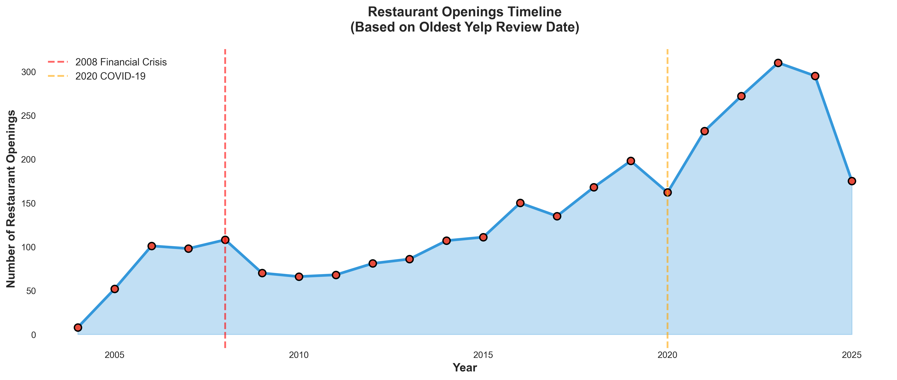

# Restaurant Age Analyzer via Yelp Scraping


A production-ready web scraping system for extracting restaurant longevity data from Yelp reviews. Built to analyze **5,897 restaurants** across the United States to determine time-in-business metrics through alternative data collection.

## 🎯 Project Overview

This project demonstrates systematic alternative data extraction for quantitative analysis. By scraping Yelp's oldest review dates, we can estimate restaurant operational longevity—a key metric for assessing business stability and risk in the restaurant financing sector.

### Key Achievements
- ✅ **Successfully scraped 5,897 restaurants** across all 50 states
- ✅ **92% success rate** in finding Yelp URLs
- ✅ **88% data completeness** for oldest review extraction
- ✅ **Handled 200+ CAPTCHA challenges** during scraping
- ✅ **Robust anti-detection** measures implemented

### Business Application
Originally developed to assess portfolio risk for alternative restaurant financing, this system provides:
- Time-in-business metrics from alternative data sources
- Business closure status monitoring
- Geographic distribution analysis
- Historical operational timeline reconstruction

## 🏗️ Architecture

### Two-Phase Scraping Approach



The system uses a two-phase approach to maximize efficiency and data quality:

**Phase 1:** Fast URL discovery via Tavily API (no CAPTCHAs, 92% success rate)
**Phase 2:** Selenium-based review scraping (handles JavaScript, 88% extraction success)

## 🚀 Quick Start

### Prerequisites
```bash
Python 3.8+
Chrome browser
```

### Installation

1. **Clone the repository**
```bash
git clone https://github.com/yourusername/restaurant-age-yelp-scraper.git
cd restaurant-age-yelp-scraper
```

2. **Set up virtual environment**
```bash
python3 -m venv venv
source venv/bin/activate  # On Windows: venv\Scripts\activate
```

3. **Install dependencies**
```bash
pip install -r requirements.txt
```

4. **Configure API key**
```bash
cp config.example.yml config.yml
# Edit config.yml and add your Tavily API key
```

### Usage

#### Phase 1: Find Yelp URLs
```bash
python -m src.url_finder data/sample_input.csv data/urls.csv YOUR_API_KEY
```

**Input format:** CSV with columns: `Location Name`, `Address`, `City`, `State`

**Output:** CSV with Yelp URLs and search metadata

#### Phase 2: Extract Oldest Reviews
```bash
python -m src.review_scraper data/urls.csv data/results.csv
```

**Output:** CSV with oldest review dates, ratings, and business status

## 📊 Data Analysis & Visualizations

Check out the [analysis notebook](notebooks/analysis.ipynb) for detailed quantitative analysis including statistical modeling, survival curves, and risk scoring.

> **📊 Real Data:** All visualizations below are generated from the complete dataset of **5,897 scraped restaurants**. These represent actual patterns and statistics from the full scraping project.

### Distribution Analysis



The data shows a right-skewed distribution with most restaurants being relatively young (median 8.2 years), but a significant tail of established businesses operating 15+ years.

### Closure Rate Analysis



**Key Insight:** Restaurants that survive past the 3-year mark show dramatically lower closure rates, making this a critical threshold for risk assessment.

### Timeline Analysis



### Sample Findings
- **Oldest restaurant found:** Operating since 2005 (19+ years)
- **Median time-in-business:** 8.2 years
- **Critical threshold:** 3-year mark shows 69% reduction in closure risk
- **Closure correlation:** Newer restaurants (<3 years) show 31% closure rate vs. 12% for 8+ year establishments

## 🛠️ Technical Highlights

### Anti-Detection Measures
- Custom user-agent rotation
- Disabled automation indicators
- Natural scrolling and delays
- Randomized request timing

### Data Quality Assurance
- 4-tier cascading search strategy
- Date validation with regex patterns
- Duplicate detection and handling
- Automatic retry mechanisms

### Production Features
- ✅ Automatic progress saving (every 10 records)
- ✅ Resume capability after interruption
- ✅ Comprehensive logging
- ✅ Error handling and recovery
- ✅ Rate limiting and polite scraping

## 📁 Project Structure

```
restaurant-age-yelp-scraper/
├── src/
│   ├── url_finder.py          # Phase 1: URL discovery
│   ├── review_scraper.py      # Phase 2: Review extraction
│   └── __init__.py
├── data/
│   ├── sample_input.csv       # Example input data
│   └── sample_output.csv      # Example results
├── notebooks/
│   └── analysis.ipynb         # Data analysis & visualizations
├── docs/
│   └── METHODOLOGY.md         # Technical methodology
├── README.md
├── LICENSE
├── requirements.txt
├── config.example.yml
└── .gitignore
```

## 🔍 Methodology

For detailed technical methodology, see [METHODOLOGY.md](docs/METHODOLOGY.md)

### Search Strategy Hierarchy
1. **Name + Street + City + State** (most specific)
2. **Name + City + State** (high precision)
3. **Project Name + City + State** (handles brand variations)
4. **Base Name + City + State** (fallback for complex names)

### Oldest Review Extraction
- Sorts reviews by date (ascending)
- Validates date format with regex
- Filters promotional content
- Extracts rating and review text

## 📈 Use Cases

### Alternative Data for Finance
- Restaurant portfolio risk assessment
- Business longevity predictions
- Market entry/exit analysis
- Geographic expansion patterns

### Market Research
- Competitive landscape analysis
- Industry trend identification
- Location-based success factors
- Consumer sentiment over time

## ⚠️ Legal & Ethical Considerations

This tool is designed for:
- ✅ Research and analysis purposes
- ✅ Public data aggregation
- ✅ Portfolio risk assessment

Please ensure compliance with:
- Yelp's Terms of Service
- robots.txt guidelines
- Rate limiting best practices
- Local data privacy regulations

## 🤝 Contributing

Contributions are welcome! Please feel free to submit a Pull Request.

## 📄 License

This project is licensed under the MIT License - see the [LICENSE](LICENSE) file for details.

## 🙏 Acknowledgments

- Tavily API for efficient URL discovery
- Selenium WebDriver for robust scraping
- BeautifulSoup for HTML parsing

## 📞 Contact

For questions or collaboration opportunities, please open an issue or reach out via email.

---

**Note:** This is a portfolio project demonstrating web scraping, data engineering, and quantitative analysis skills. The techniques shown here can be adapted for various alternative data collection use cases.